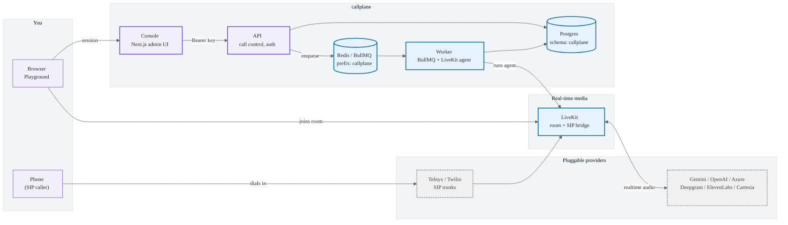
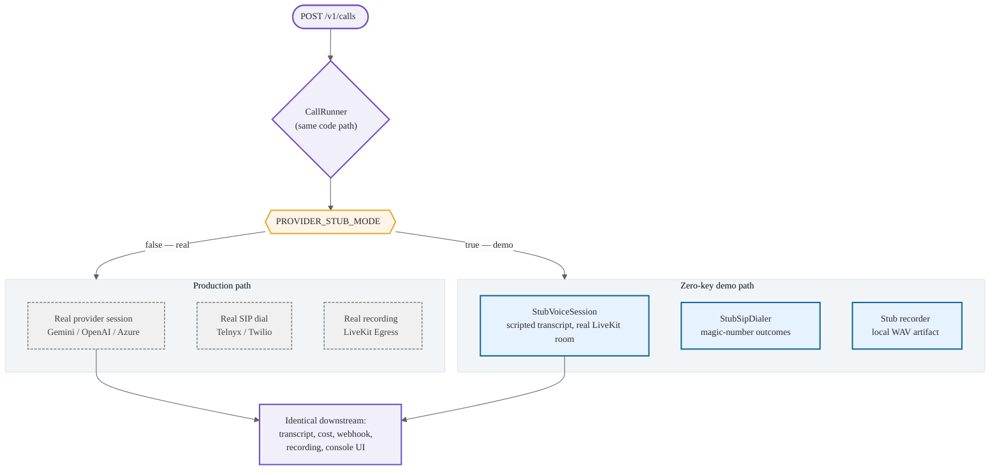
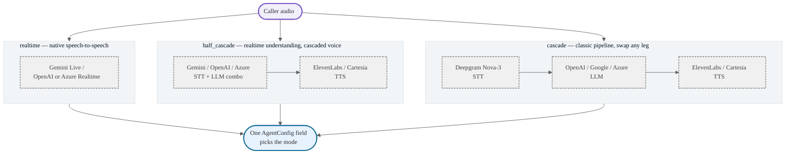

# callplane

[](https://github.com/robinjose911/callplane/actions/workflows/ci.yml)
[](./LICENSE)
[](https://nodejs.org)

> A production-grade AI voice agent control plane — three voice modes, multi-provider failover,
> SIP telephony, reliable webhooks, cost metering, and a self-service admin console. Runs and demos
> with **zero external API keys** via a stub-first architecture.

Clone it, run one command, and you're placing calls, watching live transcripts, and inspecting
signed webhook deliveries in under two minutes — no Gemini/OpenAI/Deepgram/ElevenLabs/Telnyx
account required.

## Quickstart (Tier 1 — no API keys)

```bash
git clone https://github.com/robinjose911/callplane.git
cd callplane
docker compose --profile full up -d   # Redis + a local LiveKit dev server
npm install
npm run setup                          # env files + db push + seed (idempotent)
turbo dev                              # api:4300, worker, console:4400
```

Open [http://localhost:4400](http://localhost:4400) (`admin` / `dev-local-only-change-me`), go to
**Playground**, pick an agent, and place a call — it joins a real LiveKit room and plays back a
scripted conversation in real time, transcript and all. See it end-to-end in the console's **Calls**
page: live status, transcript, cost breakdown, webhook delivery log, and a playable recording.

Every one of those pieces — the LiveKit room, the Postgres rows, the BullMQ jobs, the webhook HMAC
signature — is real. Only the *AI provider* and *telephony carrier* are stubbed. See
[**Why this exists**](#why-this-exists) below.

## What you get

| Capability | Where |
|---|---|
| 3 voice modes: `realtime` (native speech-to-speech), `cascade` (STT→LLM→TTS), `half_cascade` | Agent configs, console → Agents |
| Multi-provider failover, at call-init (never mid-call, [by design](./docs/adr/0002-failover-at-init-only.md)) | `packages/voice-core` |
| SIP telephony with trunk failover | Console → Trunks, [docs/telephony.md](./docs/telephony.md) |
| ElevenLabs-compatible signed webhooks, retried with backoff, replayable | Console → Webhooks, [docs/webhooks.md](./docs/webhooks.md) |
| Per-call, per-provider-leg cost metering, editable price table | Console → Costs / Settings, [docs/cost-model.md](./docs/cost-model.md) |
| Call recording (pluggable storage adapter) | Call detail page |
| Self-service admin console (Next.js 15) | `apps/console` |

## Feature matrix

| Voice mode | Providers | Notes |
|---|---|---|
| `realtime` | Gemini Live, OpenAI Realtime, Azure OpenAI Realtime | Native speech-to-speech, one provider handles STT+LLM+TTS |
| `cascade` | Deepgram (STT) + OpenAI/Google/Azure (LLM) + ElevenLabs/Cartesia (TTS) | Classic pipeline, swap any leg independently |
| `half_cascade` | Gemini/OpenAI/Azure (STT+LLM combo) + ElevenLabs/Cartesia (TTS) | Realtime understanding, cascaded voice |

## Architecture

### The whole stack, at a glance



### One codebase, two modes: demo and production

The single biggest reason this repo runs with zero API keys: the stub path and the production
path are the *same* `CallRunner`, branching only on one flag. There's no separate "demo build" to
fall out of sync.



### Three voice modes, your choice of provider



### Never lose a call

Provider failover and SIP trunk failover both happen at call-init, and only there — every attempt
is logged, and a call only ever ends up in `call_initiation_failure` after every trunk and every
provider has been tried.

```mermaid
%%{init: {
  "theme": "base",
  "themeVariables": {
    "primaryColor": "#F1EFFA",
    "primaryTextColor": "#2A2A2A",
    "primaryBorderColor": "#714EC4",
    "secondaryColor": "#E7F2FF",
    "secondaryBorderColor": "#0E6995",
    "tertiaryColor": "#FFF4E6",
    "tertiaryBorderColor": "#E1AB2F",
    "lineColor": "#5F5F5F",
    "textColor": "#404040",
    "mainBkg": "#F1EFFA",
    "clusterBkg": "#F2F5F7",
    "clusterBorder": "#E0E0E0",
    "edgeLabelBackground": "#FCFCFC",
    "fontFamily": "Inter, -apple-system, sans-serif",
    "fontSize": "14px"
  }
}}%%
flowchart LR
    classDef primary fill:#F1EFFA,stroke:#714EC4,stroke-width:2px,color:#2A2A2A
    classDef secondary fill:#E7F2FF,stroke:#0E6995,stroke-width:2px,color:#2A2A2A
    classDef tertiary fill:#FFF4E6,stroke:#E1AB2F,stroke-width:2px,color:#2A2A2A
    classDef external fill:#F0F0F0,stroke:#808080,stroke-width:1.5px,color:#404040,stroke-dasharray: 4 2

    Start(["Call initiated"]):::primary --> Trunk1["Trunk 1\nTelnyx"]:::external
    Trunk1 -->|busy / down| Trunk2["Trunk 2\nTwilio"]:::external
    Trunk1 -->|answers| Prov1["Provider 1\nGemini Live"]:::external
    Trunk2 -->|answers| Prov1
    Trunk2 -->|both trunks failed| Dead["call_initiation_failure\nwebhook fired"]:::tertiary

    Prov1 -->|error| Prov2["Provider 2\nOpenAI Realtime"]:::external
    Prov2 -->|error| Prov3["Provider 3\nAzure Realtime"]:::external
    Prov1 -->|ready| Live["Call connects\nIN_PROGRESS"]:::secondary
    Prov2 -->|ready| Live
    Prov3 -->|ready| Live
    Prov3 -->|all providers failed| Dead

    Note["Every attempt is a CallEvent —\nnothing fails silently"]:::tertiary
    Live -.-> Note
    Dead -.-> Note
```



Full breakdown — the call lifecycle, the data model, SIP telephony, and webhook delivery, each with
its own diagram — in [docs/architecture.md](./docs/architecture.md).

## Why this exists

Most voice-agent reference repos either (a) need real API keys before you can see anything work,
or (b) are toy demos that skip the parts that make a *production* control plane hard: reliable
webhook delivery with retries, cost accounting, SIP trunk failover, an admin console non-engineers
can actually use. callplane tries to close that gap — a stack that's honest about what "demo" vs.
"production-grade" means, and stub-first specifically so the demo and the production code path are
the same code, not two implementations that drift apart. See
[ADR 0001](./docs/adr/0001-stub-as-demo-mode.md) for the full reasoning.

**How this compares:**

- **LiveKit Agents examples** — excellent for learning the LiveKit Agents SDK itself, but they're
  single-file scripts, not a multi-tenant control plane with an admin UI, webhook delivery, or cost
  accounting.
- **Pipecat** — a strong pipeline framework for building the agent *runtime* itself; callplane is
  one layer up — the control plane that creates, monitors, and bills calls that a runtime like this
  (or LiveKit Agents, which is what callplane itself uses) executes.
- **Vapi / Retell-style hosted platforms** — closed-source SaaS; callplane is the open-source,
  self-hosted, read-the-whole-stack alternative, at the cost of you operating it yourself.

## Testing philosophy

Every stage of this build is verified by automation — no manual click-through required to prove a
feature works. Real Postgres, real Redis, a real local LiveKit server; only the AI provider SDKs
and the SIP dialer are stubbed. Each stage's build log records what shipped, what was tested, and
what was found in code review.

## Docs

- [docs/architecture.md](./docs/architecture.md) — services, call lifecycle, data model, stub design
- [docs/providers.md](./docs/providers.md) — turning on real AI providers (Tier 2)
- [docs/telephony.md](./docs/telephony.md) — SIP trunks, stub magic numbers, real PSTN (Tier 3)
- [docs/webhooks.md](./docs/webhooks.md) — signature verification, retries, replay
- [docs/cost-model.md](./docs/cost-model.md) — metering, price table, unpriced-provider handling
- [docs/adr/](./docs/adr/) — architecture decision records
- [MAINTENANCE.md](./MAINTENANCE.md) — this is a reference snapshot, not a supported product
- [CONTRIBUTING.md](./CONTRIBUTING.md) — local setup, secret scanning

## License

MIT — see [LICENSE](./LICENSE).
