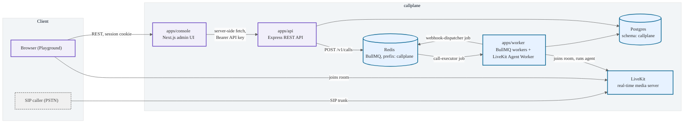
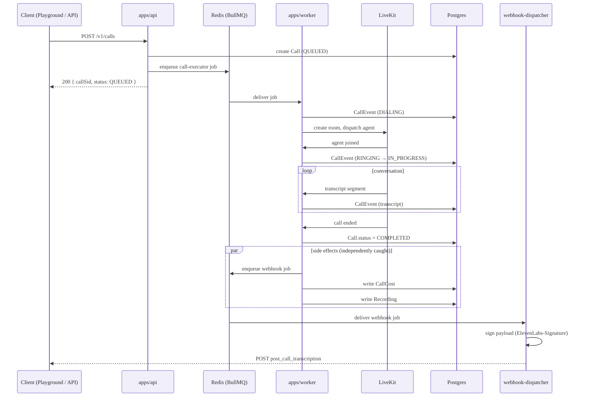
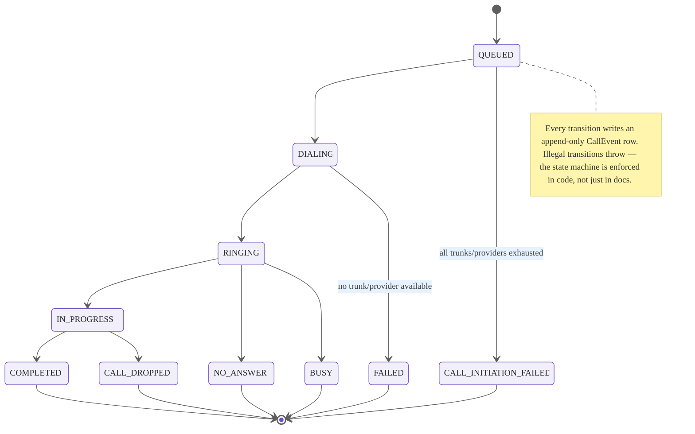
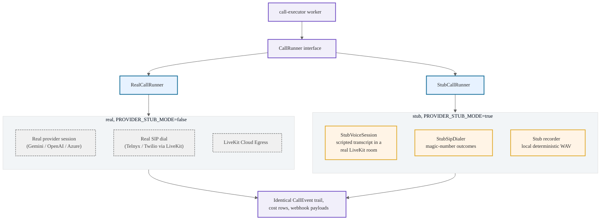
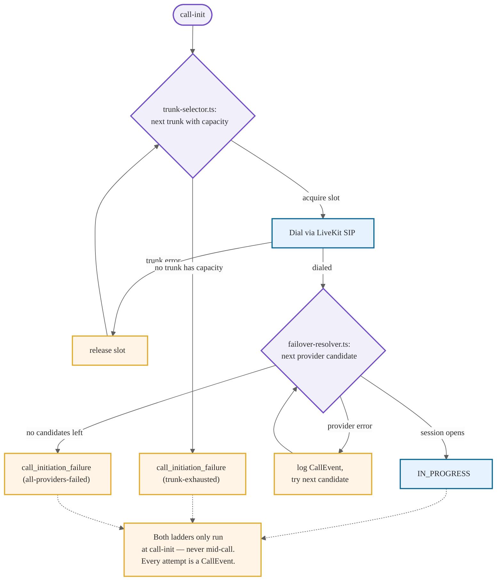
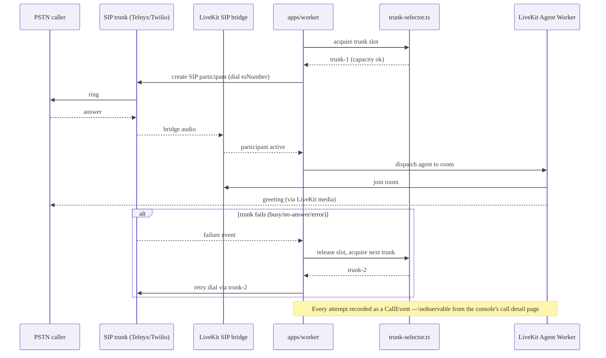
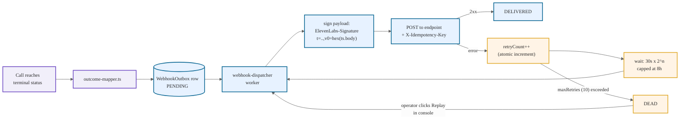
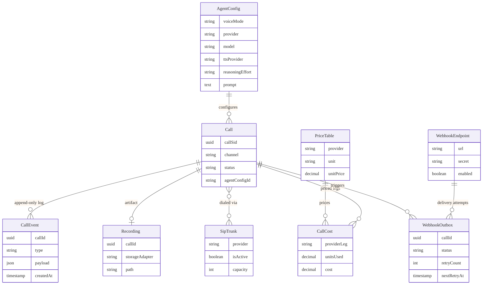

# Architecture

callplane is a Turbo monorepo with three long-running services and five shared packages. This
doc explains how a call actually flows through the system, and why the pieces are split the way
they are. Eight diagrams below cover it end to end — services, lifecycle, status transitions,
the stub-first design, failover, SIP telephony, webhook delivery, and the data model.

## Services

- **`apps/api`** is a stateless Express REST API. It never talks to LiveKit or BullMQ workers
  directly — it validates a request, writes a `Call` row, and enqueues a `call-executor` job.
  Every route requires a Bearer `CALLPLANE_API_KEY`, checked with a constant-time comparison.
- **`apps/worker`** runs two things in one process: BullMQ workers (`call-executor`,
  `webhook-dispatcher`) and the LiveKit Agent Worker (the process LiveKit invokes per-room to run
  the actual voice agent). Splitting these into separate apps was considered and rejected — they
  share the same provider/session code and scaling them independently isn't needed at this stage.
- **`apps/console`** is a Next.js 15 App Router admin UI. It never calls the API directly from the
  browser — every data fetch goes through a Server Component or a thin API proxy route
  (`apps/console/src/app/api/**/route.ts`) that attaches the API key server-side. This means the
  API key never reaches client-side JavaScript, and there's no CORS configuration to get wrong.

## A call's lifecycle

1. **Initiate.** `POST /v1/calls` (from the console's Playground, or any API client) validates the
   request against `packages/contracts`' Zod schemas, resolves the named `AgentConfig`, creates a
   `Call` row in `QUEUED` status, and enqueues a `call-executor` job in BullMQ.
2. **Execute.** The `call-executor` worker picks up the job. It resolves a `CallRunner` — the
   `RealCallRunner` for a live call, or `StubCallRunner`/`StubVoiceSession` when
   `PROVIDER_STUB_MODE=true` (see [Stub-first architecture](#the-stub-first-architecture) below) —
   and walks the call through its lifecycle, appending a `CallEvent` row and updating
   `Call.status` at each transition (`QUEUED → DIALING → RINGING → IN_PROGRESS → COMPLETED`, or
   one of the failure/rejection statuses — see [Call status state machine](#call-status-state-machine)).
3. **Converse.** For a real call, the worker's LiveKit Agent Worker joins the room, opens a
   provider session (Gemini Live / OpenAI Realtime / Azure OpenAI Realtime for `realtime` mode; a
   Deepgram → LLM → ElevenLabs/Cartesia pipeline for `cascade`; a realtime S2S combo + separate TTS
   for `half_cascade`), and streams audio both directions until the call ends.
4. **Wrap up.** Once the call reaches a terminal status, the `call-executor`'s `finally` block runs
   three independent side effects: enqueue any subscribed webhooks
   (`enqueueWebhooksForCall`), meter the call's cost per provider leg (`meterCallCost`), and write
   a recording artifact (`recordCallStub` in stub mode). Each is individually caught and logged —
   one failing never blocks or corrupts the others, or the call's own final status.
5. **Deliver.** The `webhook-dispatcher` worker picks up any enqueued webhook jobs, signs the
   payload (`ElevenLabs-Signature` format — see [Webhook delivery](#webhook-delivery) and
   [webhooks.md](./webhooks.md)), and POSTs it with exponential backoff on failure.

## Call status state machine

`packages/contracts`' `call-status.ts` is the single source of truth for which transitions are
legal; the worker throws rather than silently writing an out-of-order status. This is what makes
the console's live call monitor trustworthy — the status you see is never a guess.

## The stub-first architecture

Every external dependency — the AI provider SDKs, the SIP dialer, the recording pipeline — has a
stub implementation that's a normal, first-class code path, not test scaffolding bolted on the
side.

`PROVIDER_STUB_MODE=true` swaps in `StubVoiceSession`, which joins the real LiveKit room and
publishes a scripted conversation from a named scenario fixture (`demo_greeting`, `demo_booking`,
`demo_failure`) instead of calling a real provider. `SIP_STUB_MODE=true` swaps in
`StubSipDialer`, whose outcome is driven by magic numbers in the dialed phone number (`…0000`
answers, `…0001` busy, `…0002` no-answer, `…0003` fails the first trunk then succeeds on the
next). `RECORDING_MODE=stub` writes a deterministic silent WAV instead of using LiveKit Cloud
Egress.

This means the entire call flow — dial, converse, transcript, webhook, cost, recording — is real
end-to-end except for the one line where a real API key would go. See
[ADR 0001](./adr/0001-stub-as-demo-mode.md) for why this is a permanent architectural decision, not
a temporary testing convenience.

## Failover

Both provider failover (`packages/voice-core/src/lib/failover-resolver.ts`) and SIP trunk failover
(`packages/voice-core/src/lib/trunk-selector.ts`) only happen at call-initiation time — never
mid-call. See [ADR 0002](./adr/0002-failover-at-init-only.md) for the reasoning.

## SIP telephony

A PSTN-originated call takes the same lifecycle as a browser call, but starts with trunk selection
and a LiveKit SIP dial instead of a browser room join. Full detail, including the stub magic
numbers used in tests, in [telephony.md](./telephony.md).

## Webhook delivery

Every terminal call fires a webhook per enabled `WebhookEndpoint`, delivered through an outbox
pattern with exponential backoff and a replayable dead-letter state. Full detail, including the
signature format and a verification snippet, in [webhooks.md](./webhooks.md).

## Data model

Nine models drive everything: `AgentConfig` (voice mode + provider selection, editable from the
console), `Call` + `CallEvent` (the append-only lifecycle log), `SipTrunk` (telephony routing,
failover-ordered), `WebhookEndpoint` + `WebhookOutbox` (the delivery outbox pattern — see
[webhooks.md](./webhooks.md)), and `CallCost` + `PriceTable` + `Recording` (metering and
artifacts — see [cost-model.md](./cost-model.md)).

Everything a user would want to tune — agent configs, model choices, webhook endpoints, prices,
trunks — lives in Postgres, editable from the console. Environment variables are reserved for
secrets and infra wiring (`DATABASE_URL`, `REDIS_URL`, `LIVEKIT_URL`, the stub-mode flags, real
provider API keys).
